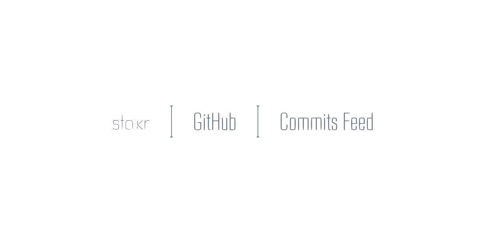
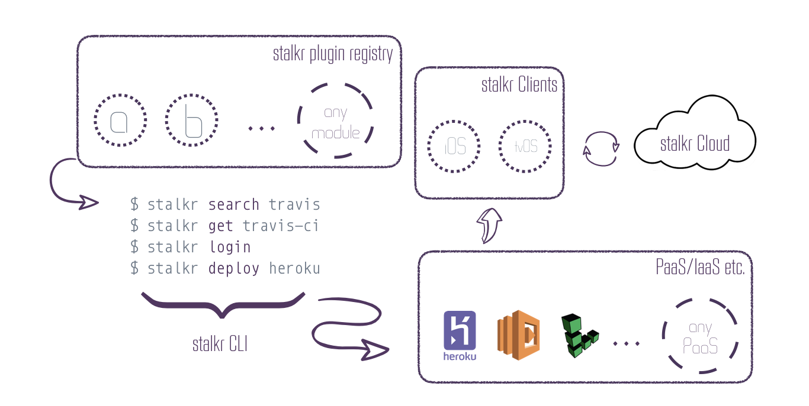

<h1 align="center">
	
	<br>
	<br>
</h1>

<br>
<br>

<p align="center">
	<a href="https://getstal.kr">stalkr</a> micro service which feeds our clients with GitHub push events.
</p>

<br>

---

<p align="center">
	<a href="">
	
	</a>&nbsp;&nbsp;&nbsp;
	<a href="">
	
	</a>
</p>

<br>

## Table of Contents

<!-- DO NOT EDIT THE COMMENTS BELOW -->

<!-- toc -->

- [What](#what)
  * [Our Product](#our-product)
  * [How it Works](#how-it-works)
    + [Architectural Overview](#architectural-overview)
      - [The Registry](#the-registry)
      - [The CLI](#the-cli)
      - [Clients](#clients)
        * [Smart TVs](#smart-tvs)
      - [The Cloud](#the-cloud)
      - [PaaS/BaaS/FaaS](#paasbaasfaas)
- [Usage](#usage)
  * [Client](#client)
  * [Server](#server)
    + [Locally](#locally)
    + [Deploying](#deploying)
      - [now.sh](#nowsh)

<!-- tocstop -->

## What

### Our Product

<p align="center">
	
</p>

*stalkr* is a simple–yet powerful–set of tools which gathers data from both continuous integration and application infrastructure monitoring tools in order to make it easier to monitor the whole developing process, in a way the entire team can see at a glance, from the very first commit to the final release.

Although our experimental release is a simple client made for the  TV, we do intend to make *stalkr* clients available on as much platforms as possible, which include:

- Other **Smart TV** platforms–e.g. Android TV, webOS, Tizen etc.;

- **SmartWatch** platforms–e.g. watchOS, Android Wear etc.;

- Popular **Mobile** platforms–e.g. iOS, Android etc.;

- Popular **Desktop** OSs–e.g. macOS, Linux, Windows etc.;

- The **Web** itself.

If you can't wait to check it out:

<p align="center">
  <a href="https://itunes.apple.com/br/app/.../...">
    
  </a>
</p>

### How it Works

#### Architectural Overview

> easy peasy lemon squeezy!

<p align="center">
  <a href="https://itunes.apple.com/br/app/.../...">
    
  </a>
</p>

##### The Registry

> Coming soon.

Use the *stalkr* **Package Catalog**/Registry to quickly and easily find open-source packages to speed your development.

It basically discovers all the available *stalkr* plugins in popular back-end registries out there–e.g. *[node.js](https://nodejs.org/en/)-based* plugins available [npmjs.com](https://www.npmjs.com/) registry can be discovered if they contain `stalkr-plugin` value in `keywords` field of `package.json`.

##### The CLI

> Coming soon.

Use the *stalkr* **CLI** to quickly bootstrap and deploy your packages right from your terminal.

It basically works as an abstraction layer over commom CLI tools used to get a *stalkr* package up and running.

##### Clients

As stated above, we do intend to have multiple clients to fetch data from your deployed micro services.

###### Smart TVs

<p align="center">
	
</p>

Right now, only the  TV one is available for download at the [App Store]().

##### The Cloud

> Coming soon.

The *stalkr* **Cloud** is *PaaS* which behaves as one our revenue streams and helps your organizing your projects across **organizations**, **teams**, **roles** etc.

**Organizations** are great for creating distinct groups of users within your company, such as divisions or groups working on similar projects.

**Teams** give organizations the ability to create groups of members and control access to projects. Team members can be granted read, write, or admin permissions to specific projects.

##### PaaS/BaaS/FaaS

Those are the services where you any stalkr micro service–such as the one whose documentation you're reading.

More information on these topics can be found at [Server](#server).

## Usage

### Client

### Server

#### Locally

1. Make sure you define the `ENV` variables below:

    ```sh
    # Pusher credentials
    export PUSHER_ID='123456'
    export PUSHER_KEY='4JEUi0C2UT49m872Euc5'
    export PUSHER_SECRET='Bzx2MlrMbNtBpZv391J1'

    # GitHub credentials
    export GITHUB_TOKEN='5K78650K9PGuTHgbVOGl26l9nQ6JuLyS'

    # Basic stalkr cell metadata
    export STALKR_TEAM='myTeam'
    export STALKR_PROJECT='myProject'
    ```

1. Clone this repository:

    ```sh
    git clone https://github.com/stalkr-io/github-commits-feed
    ```

1. Install all dependencies:

    ```sh
    # via npm
    npm install
    # or using yarn
    yarn
    ```

1. Launch it:

    ```sh
    # via npm
    npm start
    # or using yarn
    yarn start
    ```

If everything goes okay, it should now be running at [`localhost:3000`](http://localhost:3000).

#### Deploying

##### [now.sh](now.sh)

1. Install *now* globally:

    ```sh
    # via npm
    npm install -g now
    # or using yarn
    yarn global add now
    ```

1. Run *now* with the `-e` flag to define these environment variables:

    ```sh
    now -e PUSHER_ID='123456' \
           PUSHER_KEY='4JEUi0C2UT49m872Euc5' \
           PUSHER_SECRET='Bzx2MlrMbNtBpZv391J1' \
           GITHUB_TOKEN='5K78650K9PGuTHgbVOGl26l9nQ6JuLyS' \
           STALKR_TEAM='myTeam' \
           STALKR_PROJECT='myProject'
    ```

---

**Maintainer**:

> [ythecombinator.me](https://ythecombinator.me) &nbsp;&middot;&nbsp;
> GitHub [@ythecombinator](https://github.com/ythecombinator) &nbsp;&middot;&nbsp;
> Twitter [@ythecombinator](https://twitter.com/ythecombinator)
